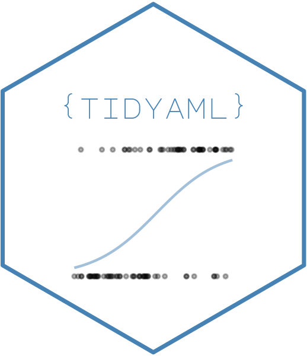

<!-- README.md is generated from README.Rmd. Please edit that file -->

```{r, include = FALSE}
knitr::opts_chunk$set(
  collapse = TRUE,
  comment = "#>",
  fig.path = "man/figures/README-",
  out.width = "100%",
  message = FALSE,
  warning = FALSE
)
```

# tidyAML 

<!-- badges: start -->
[](https://cran.r-project.org/package=tidyAML)


[](https://lifecycle.r-lib.org/articles/stages.html##experimental)
[](https://kentcdodds.github.io/makeapullrequest.com/)
<!-- badges: end -->

> **Automated Machine Learning with tidymodels** - Build and compare multiple ML models effortlessly

## Overview

To view the full wiki, click here: [Full tidyAML Wiki](https://github.com/spsanderson/tidyAML/blob/master/wiki/Home.md)

__`{tidyAML}`__ is an R package that brings the power of Automated Machine Learning (AutoML) to the `tidymodels` ecosystem. With just a few lines of code, you can generate, train, and compare multiple machine learning models simultaneously, making it perfect for both rapid prototyping and production workflows.

### Key Features

- **🚀 Fast Model Generation**: Create multiple model specifications instantly
- **🔄 Batch Training**: Train dozens of models with a single function call
- **📊 Both Regression & Classification**: Support for all common ML tasks
- **🛡️ Graceful Failure Handling**: Models fail safely without breaking your workflow
- **🎯 tidymodels Native**: Built on the robust tidymodels framework
- **⚡ No Java Required**: Unlike h2o, runs purely in R
- **🔌 Extensible**: Works with 30+ parsnip engines out of the box

### Why tidyAML?

| Feature | tidyAML | h2o | caret |
|---------|---------|-----|-------|
| tidymodels Integration | ✅ Native | ❌ No | ⚠️ Limited |
| Java Required | ✅ No | ❌ Yes | ✅ No |
| Parallel Model Training | ✅ Yes | ✅ Yes | ✅ Yes |
| Modern R Workflow | ✅ Pipes & tidy | ❌ Old style | ⚠️ Mixed |
| Active Development | ✅ Yes | ⚠️ Slowing | ❌ Maintenance |

## Table of Contents

- [Installation](#installation)
- [Quick Start](#quick-start)
- [Regression Example](#regression-example)
- [Classification Example](#classification-example)
- [Key Functions](#key-functions)
- [Visualization](#visualization)
- [Documentation](#documentation)
- [Contributing](#contributing)
- [Citation](#citation)

## Installation

Install the stable version from CRAN:

```{r eval=FALSE}
install.packages("tidyAML")
```

Or get the development version from GitHub:

```{r eval=FALSE}
# install.packages("devtools")
devtools::install_github("spsanderson/tidyAML")
```

After installation, it's recommended to set tidymodels preferences:

```{r eval=FALSE}
library(tidyAML)
tidymodels::tidymodels_prefer()
```

## Quick Start

Here's a minimal example to get you started:

```{r quickstart, eval=FALSE}
library(tidyAML)
library(recipes)

# Prepare a recipe
rec_obj <- recipe(mpg ~ ., data = mtcars)

# Generate and train multiple models at once
models <- fast_regression(
  .data = mtcars,
  .rec_obj = rec_obj,
  .parsnip_eng = c("lm", "glm", "glmnet")
)

# Extract predictions
extract_wflw_pred(models, 1:3)
```

## Regression Example

Let's build multiple regression models to predict car mileage (mpg) using the mtcars dataset:

```{r example}
library(tidyAML)
library(recipes)
library(dplyr)
```

### Creating Model Specifications

You can generate model specifications in several ways:

```{r}
# Generate all linear regression models
fast_regression_parsnip_spec_tbl(.parsnip_fns = "linear_reg")

# Select specific engines
fast_regression_parsnip_spec_tbl(.parsnip_eng = c("lm","glm"))

# Combine function and engine filters
fast_regression_parsnip_spec_tbl(
  .parsnip_eng = c("lm","glm"), 
  .parsnip_fns = "linear_reg"
)
```

### Custom Model Specifications

For more control, use `create_model_spec()`:

```{r}
create_model_spec(
  .parsnip_eng = list("lm", "glm", "glmnet"),
  .parsnip_fns = list("linear_reg", "linear_reg", "linear_reg")
)
```

### Training Multiple Models

The real power comes from training multiple models at once:

```{r}
# Create a recipe
rec_obj <- recipe(mpg ~ ., data = mtcars)

# Train multiple models
models_tbl <- fast_regression(
  .data = mtcars, 
  .rec_obj = rec_obj, 
  .parsnip_eng = c("lm", "glm"),
  .parsnip_fns = "linear_reg"
)

glimpse(models_tbl)
```

The function uses `purrr::safely()` to handle failures gracefully - if a model can't be trained (e.g., missing dependencies), it returns NULL without stopping the entire process.

### Working with Predictions

Extract predictions from trained models:

```{r}
# Get predictions from all models
predictions <- extract_wflw_pred(models_tbl, 1:2)
predictions
```

### Analyzing Residuals

Get model residuals for diagnostic purposes:

```{r}
# Extract residuals
residuals <- extract_regression_residuals(models_tbl)
residuals[[1]]  # View first model's residuals
```

## Classification Example

tidyAML also excels at classification tasks. Here's an example using the Titanic dataset:

```{r classification}
library(tidyr)

# Prepare data
df <- Titanic |>
  as_tibble() |>
  uncount(n) |>
  mutate(across(everything(), as.factor))

# Create recipe
rec_obj <- recipe(Survived ~ ., data = df)

# Train multiple classification models
class_models <- fast_classification(
  .data = df,
  .rec_obj = rec_obj,
  .parsnip_eng = c("glm", "glmnet"),
  .parsnip_fns = "logistic_reg"
)

glimpse(class_models)
```

### Extract Classification Predictions

```{r}
# Get predictions
class_predictions <- extract_wflw_pred(class_models, 1:2)
class_predictions
```

## Key Functions

### Model Generation
- `fast_regression()` - Generate and train multiple regression models
- `fast_classification()` - Generate and train multiple classification models
- `fast_regression_parsnip_spec_tbl()` - Create regression model specifications
- `fast_classification_parsnip_spec_tbl()` - Create classification model specifications
- `create_model_spec()` - Custom model specification creation

### Extractors
- `extract_wflw_pred()` - Extract workflow predictions
- `extract_wflw()` - Extract workflow objects
- `extract_wflw_fit()` - Extract fitted workflows
- `extract_model_spec()` - Extract model specifications
- `extract_regression_residuals()` - Extract residuals from regression models
- `extract_tunable_params()` - Extract tunable parameters

### Utilities
- `create_splits()` - Create rsample splits
- `core_packages()` - List core package dependencies
- `install_deps()` - Install tidyAML dependencies
- `load_deps()` - Load required packages

### Visualization
- `plot_regression_predictions()` - Plot regression predictions
- `plot_regression_residuals()` - Plot regression residuals

## Visualization

Visualize model performance easily:

```{r visualization, eval=FALSE}
# Plot predictions
plot_regression_predictions(models_tbl)

# Plot residuals
plot_regression_residuals(models_tbl)
```

## Documentation

- **Website**: [https://www.spsanderson.com/tidyAML/](https://www.spsanderson.com/tidyAML/)
- **Getting Started Vignette**: `vignette("getting-started", package = "tidyAML")`
- **Function Reference**: [https://www.spsanderson.com/tidyAML/reference/](https://www.spsanderson.com/tidyAML/reference/)
- **GitHub Repository**: [https://github.com/spsanderson/tidyAML](https://github.com/spsanderson/tidyAML)
- **Bug Reports**: [https://github.com/spsanderson/tidyAML/issues](https://github.com/spsanderson/tidyAML/issues)

## Contributing

Contributions are welcome! Please see [CONTRIBUTING.md](CONTRIBUTING.md) for guidelines. 

Key ways to contribute:
- Report bugs or request features via [GitHub Issues](https://github.com/spsanderson/tidyAML/issues)
- Submit Pull Requests for bug fixes or new features
- Improve documentation or add examples
- Share your use cases and feedback

Please note that this project is released with a [Contributor Code of Conduct](CODE_OF_CONDUCT.md). By participating in this project you agree to abide by its terms.

## Citation

If you use tidyAML in your research or work, please cite it:

```{r citation, eval=FALSE}
citation("tidyAML")
```

## Acknowledgments

- Thanks to [Garrick Aden-Buie](https://fosstodon.org/@grrrck/109479826278916014) for the package name suggestion
- Built on the excellent [tidymodels](https://www.tidymodels.org/) framework
- Inspired by [h2o](https://h2o.ai/) but designed to work seamlessly with tidyverse tools

## License

MIT © Steven P. Sanderson II, MPH

---

**Need Help?** 
- 📖 Read the [Getting Started Guide](https://www.spsanderson.com/tidyAML/articles/getting-started.html)
- 💬 Open an [Issue](https://github.com/spsanderson/tidyAML/issues)
- ⭐ Star the repo if you find it useful!
