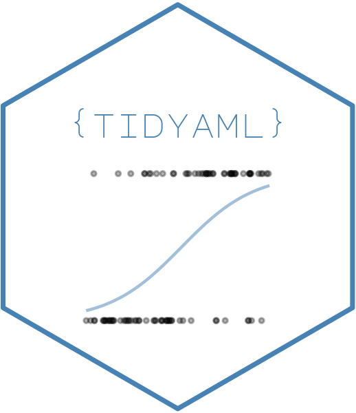

<!-- README.md is generated from README.Rmd. Please edit that file -->

# tidyAML 

<!-- badges: start -->

[](https://cran.r-project.org/package=tidyAML)

 [](https://lifecycle.r-lib.org/articles/stages.html#experimental)
[](https://kentcdodds.github.io/makeapullrequest.com/)
<!-- badges: end -->

> **Automated Machine Learning with tidymodels** - Build and compare
> multiple ML models effortlessly

## Overview

To view the full wiki, click here: [Full tidyAML
Wiki](https://github.com/spsanderson/tidyAML/blob/master/wiki/Home.md)

**`{tidyAML}`** is an R package that brings the power of Automated
Machine Learning (AutoML) to the `tidymodels` ecosystem. With just a few
lines of code, you can generate, train, and compare multiple machine
learning models simultaneously, making it perfect for both rapid
prototyping and production workflows.

### Key Features

- **🚀 Fast Model Generation**: Create multiple model specifications
  instantly
- **🔄 Batch Training**: Train dozens of models with a single function
  call
- **📊 Both Regression & Classification**: Support for all common ML
  tasks
- **🛡️ Graceful Failure Handling**: Models fail safely without breaking
  your workflow
- **🎯 tidymodels Native**: Built on the robust tidymodels framework
- **⚡ No Java Required**: Unlike h2o, runs purely in R
- **🔌 Extensible**: Works with 30+ parsnip engines out of the box

### Why tidyAML?

| Feature                 | tidyAML         | h2o          | caret          |
|-------------------------|-----------------|--------------|----------------|
| tidymodels Integration  | ✅ Native       | ❌ No        | ⚠️ Limited     |
| Java Required           | ✅ No           | ❌ Yes       | ✅ No          |
| Parallel Model Training | ✅ Yes          | ✅ Yes       | ✅ Yes         |
| Modern R Workflow       | ✅ Pipes & tidy | ❌ Old style | ⚠️ Mixed       |
| Active Development      | ✅ Yes          | ⚠️ Slowing   | ❌ Maintenance |

## Table of Contents

- [Installation](#installation)
- [Quick Start](#quick-start)
- [Regression Example](#regression-example)
- [Classification Example](#classification-example)
- [Key Functions](#key-functions)
- [Visualization](#visualization)
- [Documentation](#documentation)
- [Contributing](#contributing)
- [Citation](#citation)

## Installation

Install the stable version from CRAN:

``` r
install.packages("tidyAML")
```

Or get the development version from GitHub:

``` r
# install.packages("devtools")
devtools::install_github("spsanderson/tidyAML")
```

After installation, it’s recommended to set tidymodels preferences:

``` r
library(tidyAML)
tidymodels::tidymodels_prefer()
```

## Quick Start

Here’s a minimal example to get you started:

``` r
library(tidyAML)
library(recipes)

# Prepare a recipe
rec_obj <- recipe(mpg ~ ., data = mtcars)

# Generate and train multiple models at once
models <- fast_regression(
  .data = mtcars,
  .rec_obj = rec_obj,
  .parsnip_eng = c("lm", "glm", "glmnet")
)

# Extract predictions
extract_wflw_pred(models, 1:3)
```

## Regression Example

Let’s build multiple regression models to predict car mileage (mpg)
using the mtcars dataset:

``` r
library(tidyAML)
library(recipes)
library(dplyr)
```

### Creating Model Specifications

You can generate model specifications in several ways:

``` r
# Generate all linear regression models
fast_regression_parsnip_spec_tbl(.parsnip_fns = "linear_reg")
#> # A tibble: 11 × 5
#>    .model_id .parsnip_engine .parsnip_mode .parsnip_fns model_spec
#>        <int> <chr>           <chr>         <chr>        <list>    
#>  1         1 lm              regression    linear_reg   <spec[+]> 
#>  2         2 brulee          regression    linear_reg   <spec[+]> 
#>  3         3 gee             regression    linear_reg   <spec[+]> 
#>  4         4 glm             regression    linear_reg   <spec[+]> 
#>  5         5 glmer           regression    linear_reg   <spec[+]> 
#>  6         6 glmnet          regression    linear_reg   <spec[+]> 
#>  7         7 gls             regression    linear_reg   <spec[+]> 
#>  8         8 lme             regression    linear_reg   <spec[+]> 
#>  9         9 lmer            regression    linear_reg   <spec[+]> 
#> 10        10 stan            regression    linear_reg   <spec[+]> 
#> 11        11 stan_glmer      regression    linear_reg   <spec[+]>

# Select specific engines
fast_regression_parsnip_spec_tbl(.parsnip_eng = c("lm","glm"))
#> # A tibble: 3 × 5
#>   .model_id .parsnip_engine .parsnip_mode .parsnip_fns model_spec
#>       <int> <chr>           <chr>         <chr>        <list>    
#> 1         1 lm              regression    linear_reg   <spec[+]> 
#> 2         2 glm             regression    linear_reg   <spec[+]> 
#> 3         3 glm             regression    poisson_reg  <spec[+]>

# Combine function and engine filters
fast_regression_parsnip_spec_tbl(
  .parsnip_eng = c("lm","glm"), 
  .parsnip_fns = "linear_reg"
)
#> # A tibble: 2 × 5
#>   .model_id .parsnip_engine .parsnip_mode .parsnip_fns model_spec
#>       <int> <chr>           <chr>         <chr>        <list>    
#> 1         1 lm              regression    linear_reg   <spec[+]> 
#> 2         2 glm             regression    linear_reg   <spec[+]>
```

### Custom Model Specifications

For more control, use `create_model_spec()`:

``` r
create_model_spec(
  .parsnip_eng = list("lm", "glm", "glmnet"),
  .parsnip_fns = list("linear_reg", "linear_reg", "linear_reg")
)
#> # A tibble: 3 × 4
#>   .parsnip_engine .parsnip_mode .parsnip_fns .model_spec
#>   <chr>           <chr>         <chr>        <list>     
#> 1 lm              regression    linear_reg   <spec[+]>  
#> 2 glm             regression    linear_reg   <spec[+]>  
#> 3 glmnet          regression    linear_reg   <spec[+]>
```

### Training Multiple Models

The real power comes from training multiple models at once:

``` r
# Create a recipe
rec_obj <- recipe(mpg ~ ., data = mtcars)

# Train multiple models
set.seed(42)
models_tbl <- fast_regression(
  .data = mtcars, 
  .rec_obj = rec_obj, 
  .parsnip_eng = c("lm", "glm"),
  .parsnip_fns = "linear_reg"
)

glimpse(models_tbl)
#> Rows: 2
#> Columns: 8
#> $ .model_id       <int> 1, 2
#> $ .parsnip_engine <chr> "lm", "glm"
#> $ .parsnip_mode   <chr> "regression", "regression"
#> $ .parsnip_fns    <chr> "linear_reg", "linear_reg"
#> $ model_spec      <list> [~NULL, ~NULL, NULL, regression, TRUE, NULL, lm, TRUE,…
#> $ wflw            <list> [cyl, disp, hp, drat, wt, qsec, vs, am, gear, carb, mp…
#> $ fitted_wflw     <list> [cyl, disp, hp, drat, wt, qsec, vs, am, gear, carb, mp…
#> $ pred_wflw       <list> [<tbl_df[64 x 3]>], [<tbl_df[64 x 3]>]
```

The function uses `purrr::safely()` to handle failures gracefully - if a
model can’t be trained (e.g., missing dependencies), it returns NULL
without stopping the entire process.

### Working with Predictions

Extract predictions from trained models:

``` r
# Get predictions from all models
predictions <- extract_wflw_pred(models_tbl, 1:2)
predictions
#> # A tibble: 128 × 4
#>    .model_type     .data_category .data_type .value
#>    <chr>           <chr>          <chr>       <dbl>
#>  1 lm - linear_reg actual         actual       14.7
#>  2 lm - linear_reg actual         actual       18.7
#>  3 lm - linear_reg actual         actual       21  
#>  4 lm - linear_reg actual         actual       19.2
#>  5 lm - linear_reg actual         actual       19.2
#>  6 lm - linear_reg actual         actual       21.4
#>  7 lm - linear_reg actual         actual       32.4
#>  8 lm - linear_reg actual         actual       21.4
#>  9 lm - linear_reg actual         actual       10.4
#> 10 lm - linear_reg actual         actual       14.3
#> # ℹ 118 more rows
```

### Analyzing Residuals

Get model residuals for diagnostic purposes:

``` r
# Extract residuals
residuals <- extract_regression_residuals(models_tbl)
residuals[[1]]  # View first model's residuals
#> # A tibble: 32 × 4
#>    .model_type     .actual .predicted  .resid
#>    <chr>             <dbl>      <dbl>   <dbl>
#>  1 lm - linear_reg    14.7       11.8  2.88  
#>  2 lm - linear_reg    18.7       19.3 -0.620 
#>  3 lm - linear_reg    21         20.9  0.0888
#>  4 lm - linear_reg    19.2       18.1  1.06  
#>  5 lm - linear_reg    19.2       18.2  1.01  
#>  6 lm - linear_reg    21.4       20.1  1.27  
#>  7 lm - linear_reg    32.4       28.1  4.33  
#>  8 lm - linear_reg    21.4       23.7 -2.34  
#>  9 lm - linear_reg    10.4       11.6 -1.19  
#> 10 lm - linear_reg    14.3       13.8  0.488 
#> # ℹ 22 more rows
```

## Classification Example

tidyAML also excels at classification tasks. Here’s an example using the
Titanic dataset:

``` r
library(tidyr)

# Prepare data
df <- Titanic |>
  as_tibble() |>
  uncount(n) |>
  mutate(across(everything(), as.factor))

# Create recipe
rec_obj <- recipe(Survived ~ ., data = df)

# Train multiple classification models
class_models <- fast_classification(
  .data = df,
  .rec_obj = rec_obj,
  .parsnip_eng = c("glm", "glmnet"),
  .parsnip_fns = "logistic_reg"
)

glimpse(class_models)
#> Rows: 1
#> Columns: 8
#> $ .model_id       <int> 1
#> $ .parsnip_engine <chr> "glm"
#> $ .parsnip_mode   <chr> "classification"
#> $ .parsnip_fns    <chr> "logistic_reg"
#> $ model_spec      <list> [~NULL, ~NULL, NULL, classification, TRUE, NULL, glm, …
#> $ wflw            <list> [Class, Sex, Age, Survived, factor, unordered, nominal…
#> $ fitted_wflw     <list> [Class, Sex, Age, Survived, factor, unordered, nominal…
#> $ pred_wflw       <list> [<tbl_df[4402 x 3]>]
```

### Extract Classification Predictions

``` r
# Get predictions
class_predictions <- extract_wflw_pred(class_models, 1:2)
class_predictions
#> # A tibble: 4,402 × 4
#>    .model_type        .data_category .data_type .value
#>    <chr>              <chr>          <chr>      <fct> 
#>  1 glm - logistic_reg actual         actual     No    
#>  2 glm - logistic_reg actual         actual     No    
#>  3 glm - logistic_reg actual         actual     No    
#>  4 glm - logistic_reg actual         actual     No    
#>  5 glm - logistic_reg actual         actual     No    
#>  6 glm - logistic_reg actual         actual     Yes   
#>  7 glm - logistic_reg actual         actual     No    
#>  8 glm - logistic_reg actual         actual     No    
#>  9 glm - logistic_reg actual         actual     No    
#> 10 glm - logistic_reg actual         actual     No    
#> # ℹ 4,392 more rows
```

## Key Functions

### Model Generation

- `fast_regression()` - Generate and train multiple regression models
- `fast_classification()` - Generate and train multiple classification
  models
- `fast_regression_parsnip_spec_tbl()` - Create regression model
  specifications
- `fast_classification_parsnip_spec_tbl()` - Create classification model
  specifications
- `create_model_spec()` - Custom model specification creation

### Extractors

- `extract_wflw_pred()` - Extract workflow predictions
- `extract_wflw()` - Extract workflow objects
- `extract_wflw_fit()` - Extract fitted workflows
- `extract_model_spec()` - Extract model specifications
- `extract_regression_residuals()` - Extract residuals from regression
  models
- `extract_tunable_params()` - Extract tunable parameters

### Utilities

- `create_splits()` - Create rsample splits
- `core_packages()` - List core package dependencies
- `install_deps()` - Install tidyAML dependencies
- `load_deps()` - Load required packages

### Visualization

- `plot_regression_predictions()` - Plot regression predictions
- `plot_regression_residuals()` - Plot regression residuals

## Visualization

Visualize model performance easily:

``` r
# Plot predictions
plot_regression_predictions(models_tbl)

# Plot residuals
plot_regression_residuals(models_tbl)
```

## Documentation

- **Website**: <https://www.spsanderson.com/tidyAML/>
- **Getting Started Vignette**:
  `vignette("getting-started", package = "tidyAML")`
- **Function Reference**:
  <https://www.spsanderson.com/tidyAML/reference/>
- **GitHub Repository**: <https://github.com/spsanderson/tidyAML>
- **Bug Reports**: <https://github.com/spsanderson/tidyAML/issues>

## Contributing

Contributions are welcome!

Key ways to contribute: - Report bugs or request features via [GitHub
Issues](https://github.com/spsanderson/tidyAML/issues) - Submit Pull
Requests for bug fixes or new features - Improve documentation or add
examples - Share your use cases and feedback

## Citation

If you use tidyAML in your research or work, please cite it:

``` r
citation("tidyAML")
```

## Acknowledgments

- Thanks to [Garrick
  Aden-Buie](https://fosstodon.org/@grrrck/109479826278916014) for the
  package name suggestion
- Built on the excellent [tidymodels](https://www.tidymodels.org/)
  framework
- Inspired by [h2o](https://h2o.ai/) but designed to work seamlessly
  with tidyverse tools

## License

MIT © Steven P. Sanderson II, MPH

------------------------------------------------------------------------

**Need Help?** - 📖 Read the [Getting Started
Guide](https://www.spsanderson.com/tidyAML/articles/getting-started.html) -
💬 Open an [Issue](https://github.com/spsanderson/tidyAML/issues) - ⭐
Star the repo if you find it useful!
